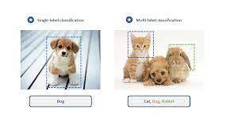

# Data Science Portfolio
---
## Machine learning

### Classification using Logistic Regression and Random Forest

Classification algorithms such as logistic regression, Decision Trees, Random Forests, and SVMs have various use cases for businesses. They can be used for customer segmentation, fraud detection, credit risk assessment, and image recognition, among others. These algorithms enable businesses to automate processes, protect against financial losses, and tailor their marketing campaigns or product offerings to specific customer groups.

---
### Client Subscription

The client subscription data , can be used for predictive modeling, customer segmentation, risk management, competitive analysis, and regulatory compliance. These use cases can help businesses better understand their customers, tailor their marketing strategies, make informed decisions about extending credit, identify areas of market share loss, and comply with regulations.

---
### Convolutional Neural Network (CNN) for Recognition for Classification

CNNs are used in industries like manufacturing and security for image recognition, fraud detection, sentiment analysis, and recommendation systems. They can help businesses automate processes, protect against scams and fraud, and personalize user recommendations based on their image preferences.

---
